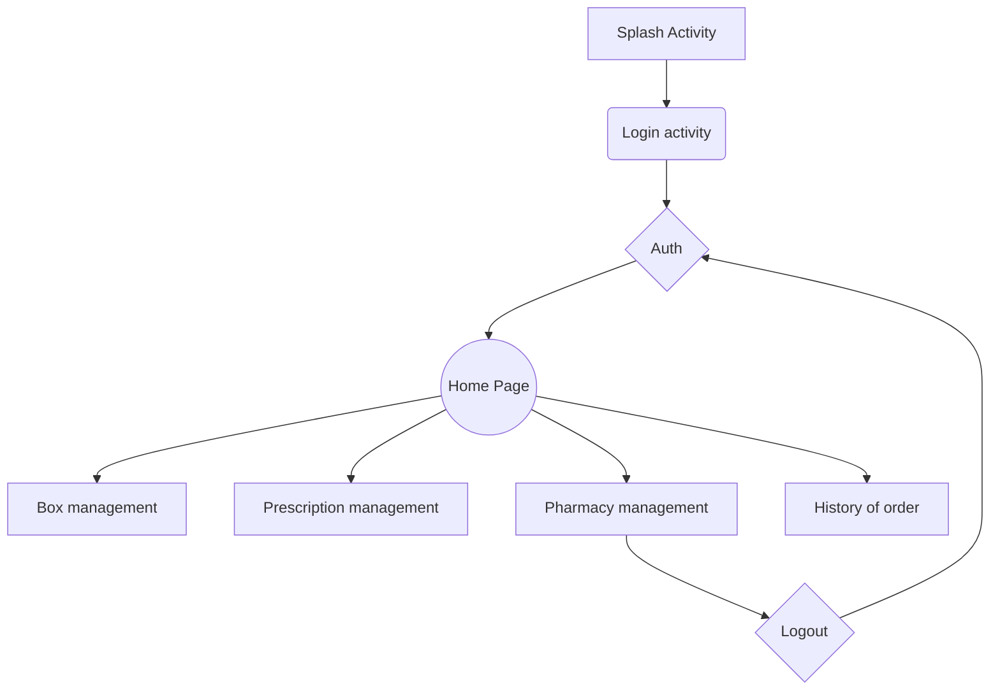
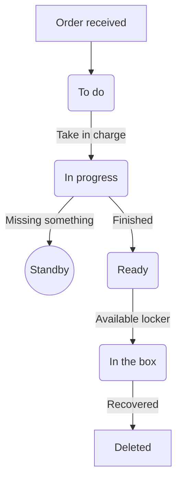

  
# Pharma-collect mobile app  
  
Pharma collect is a mobile app which allow to send prescription/order to a particular pharmacy and pick out it few moment later into a fully secure box. Pharma collect is by the way cut in two different applications :  
- Pharma-collect Client  
- Pharma-collect Pro  
  
   
  
# Pharma-Collect Pro  
  
The profesionnal part will allow the user to :  
- **Manage prescription**  
 - Having a management panel with To do / In progress / Done order  
   - Notifie the state of an order   
   - Access to a patient sheet and get info (secu / age / allergies / ... )   
  
- **Manage boxes**  
 - Can see which box is empty or available   
   - Being notifie when drugs were forgotten into the box  
  
- **Manage employees** (only for pharmacie's boss)  
   - Create account for employees   
   - Create a pharmacy (to see)  
   - Manage the attribute of a his pharmacy (location, opening hours, shop or not ...)  
  
## Technologies of Pharma-collect  
  
The app is made with **Kotlin** and **Java** languages.  
We work with fragment and **mvvm** technology (Model-View-ViewModel)  
  
  
  
  
The application is linked to a server (see previous drawing). We are able to talk with it thanks to an http request (in fact we have **https** request to get safer transactions). In addition, the most sensitive information are encrypted with **BCrypt** technolgy and cannot be violated.  
  
To be connected with the locker, Pharma-collect will use the **QR code technology**. It will allow us to verify the identity of the user in front of the box (informations verified by the locker connected to the server).  
  
## Details  
  
### Architecture of the app

### Prescription life cycle

Life cycle of the order state

### State of progress

- Let see the project board
- All required http request are on the Web server repository
